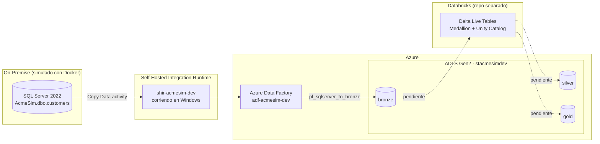

# Acme On-Premise → Azure Migration (Simulación)

Simulación end-to-end de una migración de datos on-premise hacia Azure, construida como proyecto de portafolio para procesos de entrevista como **Data Engineer**. "Acme" es un alias genérico; el proyecto no representa ninguna infraestructura real de producción.

## Arquitectura



**Estado actual:** el flujo on-premise → Bronze está completo y probado. La transformación Bronze → Silver → Gold vive en un repo aparte de Databricks (DABs + Delta Live Tables + Unity Catalog) y su integración con el `bronze` de este proyecto está pendiente de documentar (ver [Roadmap](#roadmap)).

## Stack

| Componente | Detalle |
|---|---|
| Base de datos on-premise | SQL Server 2022 en Docker (`mcr.microsoft.com/mssql/server:2022-latest`) |
| Generación de datos | Python + Faker + pyodbc + python-dotenv |
| Integración | Self-Hosted Integration Runtime (SHIR) |
| Orquestación / ingesta | Azure Data Factory |
| Almacenamiento | Azure Data Lake Storage Gen2 (containers `bronze` / `silver` / `gold`) |
| Transformación (repo aparte) | Databricks · Delta Live Tables · Unity Catalog |

## Convenciones

- Nomenclatura de recursos: `<tipo>-<proyecto>-<entorno>`, ej. `rg-acmesim-dev`, `stacmesimdev`, `adf-acmesim-dev`
- Secretos: nunca hardcodeados — siempre vía `.env` (gitignored) o Azure Key Vault
- SQL en `snake_case`, nombres en inglés para tablas/columnas
- ADF: Pipelines `pl_<origen>_to_<destino>`, Datasets `ds_<sistema>_<entidad>`, Linked Services `ls_<sistema>`

## Estructura del repo

```
acme-onprem-azure-migration/
├── README.md
├── .gitignore
├── .env.example
├── docker/
│   └── docker-compose.yml
├── scripts/
│   ├── generate_fake_data.py
│   └── requirements.txt
├── adf/
│   ├── linkedServices/
│   ├── datasets/
│   └── pipelines/
└── docs/
    └── troubleshooting.md
```

## Cómo correrlo

```bash
# 1. Levantar SQL Server on-premise
cd docker
cp ../.env.example ../.env   # completar con tu password
docker compose up -d

# 2. Instalar dependencias y poblar datos ficticios
cd ../scripts
pip install -r requirements.txt
python generate_fake_data.py

# 3. Ejecutar el pipeline pl_sqlserver_to_bronze desde Azure Data Factory
#    (requiere el SHIR corriendo y registrado — ver docs/troubleshooting.md)
```

**Nota operativa:** cada reinicio de Windows detiene Docker Desktop y el servicio "Integration Runtime Service"; hay que reactivarlos manualmente (o configurar inicio automático) antes de volver a correr el pipeline.

## Caso para entrevista (formato STAR)

**Situación:** En un proceso de entrevista para Data Engineer Jr, dos stakeholders del mismo proceso pedían perfiles distintos: RH buscaba experiencia con Azure Data Factory, Self-Hosted Integration Runtime y T-SQL sobre fuentes on-premise; el arquitecto técnico buscaba exposición a Python/Scala, Databricks y arquitectura Lakehouse.

**Tarea:** No contaba con un proyecto que cubriera el flujo on-premise → Azure con IR self-hosted, así que construí uno desde cero como pieza de portafolio, simulando un origen on-premise real con Docker.

**Acción:** Levanté un SQL Server on-premise en contenedor, generé datos ficticios con Faker, instalé y configuré un Self-Hosted Integration Runtime, y construí un pipeline en Azure Data Factory (Linked Services, Datasets, Copy Data activity) para mover los datos hacia ADLS Gen2 en capa Bronze siguiendo arquitectura Medallion. En el camino diagnostiqué y resolví un error de compatibilidad entre el SHIR y versiones modernas de Java (ver [docs/troubleshooting.md](docs/troubleshooting.md)).

**Resultado:** Pipeline funcional end-to-end, documentado y reproducible, que cubre exactamente el gap técnico que RH había señalado, y que se conecta conceptualmente con un segundo proyecto propio de Databricks/Lakehouse que cubre el gap señalado por el arquitecto.

## Roadmap

- [ ] **Fase 5 — Databricks:** documentar cómo el repo de Databricks (DABs, Delta Live Tables, Unity Catalog) lee desde el container `bronze` generado aquí.
- [ ] **Fase 6 — Seguridad:** migrar de Account Key a Service Principal + Azure Key Vault (`kv-acmesim-dev`) + RBAC (`Storage Blob Data Contributor`) en los Linked Services de ADF.
- [ ] Exposición práctica mínima a Scala.

## Troubleshooting

Ver [docs/troubleshooting.md](docs/troubleshooting.md) para el detalle del error `JreNotFound` del Self-Hosted Integration Runtime y su solución.
