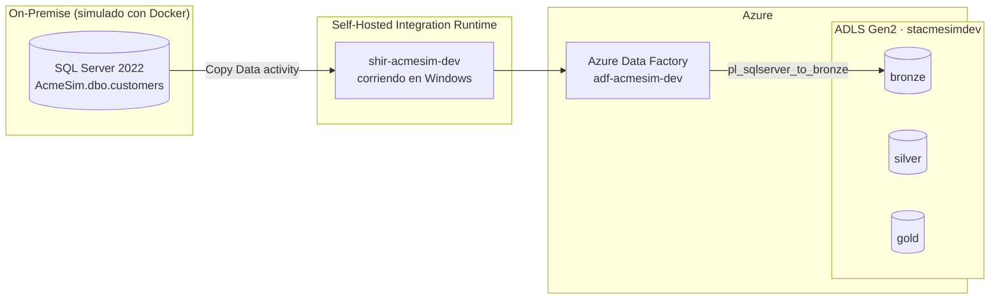

# Acme On-Premise → Azure Migration (Simulación)

Simulación end-to-end de una migración de datos on-premise hacia Azure. "Acme" es un alias genérico; el proyecto no representa ninguna infraestructura real de producción.

## Arquitectura



El pipeline `pl_sqlserver_to_bronze` copia la tabla `customers` desde SQL Server on-premise hacia el container `bronze` en formato Parquet.

## Stack

| Componente | Detalle |
|---|---|
| Base de datos on-premise | SQL Server 2022 en Docker (`mcr.microsoft.com/mssql/server:2022-latest`) |
| Generación de datos | Python + Faker + pyodbc + python-dotenv |
| Integración | Self-Hosted Integration Runtime (SHIR) |
| Orquestación / ingesta | Azure Data Factory |
| Almacenamiento | Azure Data Lake Storage Gen2 (containers `bronze` / `silver` / `gold`) |

## Convenciones

- Nomenclatura de recursos: `<tipo>-<proyecto>-<entorno>`, ej. `rg-acmesim-dev`, `stacmesimdev`, `adf-acmesim-dev`
- Secretos: nunca hardcodeados — siempre vía `.env` (gitignored) o Azure Key Vault
- SQL en `snake_case`, nombres en inglés para tablas/columnas
- ADF: Pipelines `pl_<origen>_to_<destino>`, Datasets `ds_<sistema>_<entidad>`, Linked Services `ls_<sistema>`

## Seguridad

La autenticación hacia ADLS Gen2 usa un Service Principal con permisos acotados (rol Storage Blob Data Contributor, scope limitado al Storage Account), con su credencial almacenada en Azure Key Vault — sin secretos expuestos en la configuración de ADF.

## Estructura del repo

```
acme-onprem-azure-migration/
├── README.md
├── .gitignore
├── .env.example
├── docker/
│   └── docker-compose.yml
├── scripts/
│   ├── generate_fake_data.py
│   └── requirements.txt
├── adf/
│   ├── linkedServices/
│   ├── datasets/
│   ├── pipelines/
│   └── integrationRuntime/
└── docs/
    └── troubleshooting.md
```

## Cómo correrlo

```bash
# 1. Levantar SQL Server on-premise
cd docker
cp ../.env.example ../.env   # completar con tu password
docker compose up -d

# 2. Instalar dependencias y poblar datos ficticios
cd ../scripts
pip install -r requirements.txt
python generate_fake_data.py

# 3. Ejecutar el pipeline pl_sqlserver_to_bronze desde Azure Data Factory
#    (requiere el SHIR corriendo y registrado — ver docs/troubleshooting.md)
```

**Nota operativa:** cada reinicio de Windows detiene Docker Desktop y el servicio "Integration Runtime Service"; hay que reactivarlos manualmente (o configurar inicio automático) antes de volver a correr el pipeline.

## Troubleshooting

Ver [docs/troubleshooting.md](docs/troubleshooting.md) para el detalle del error `JreNotFound` del Self-Hosted Integration Runtime y su solución.
